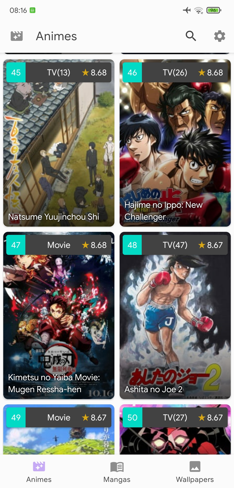
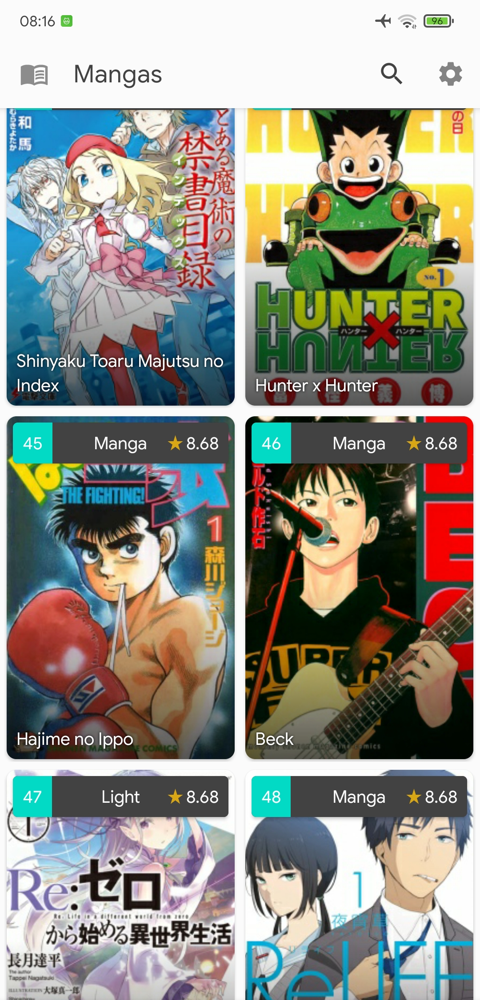
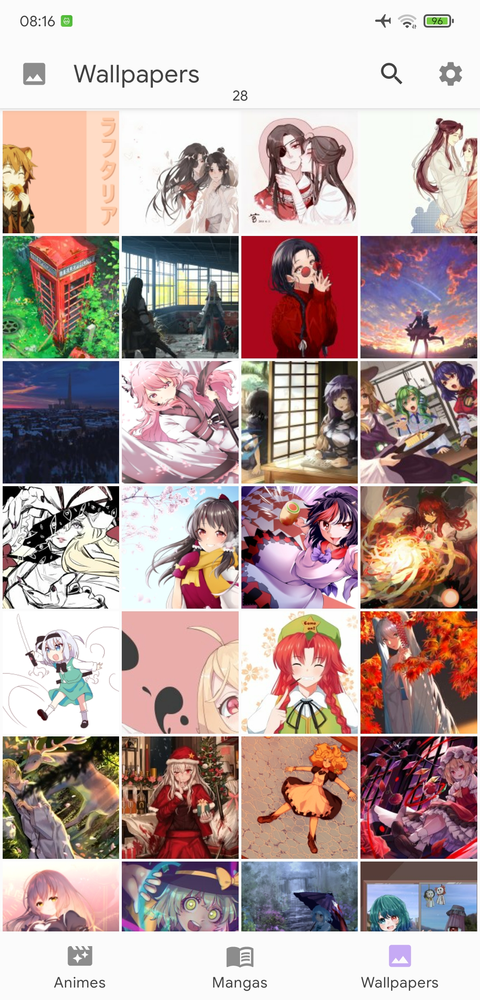
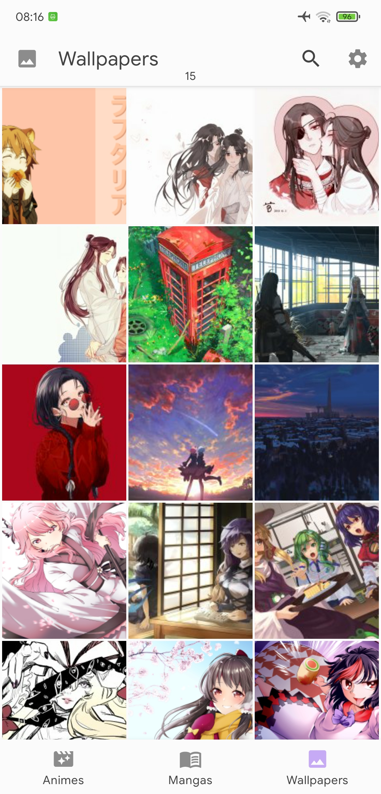
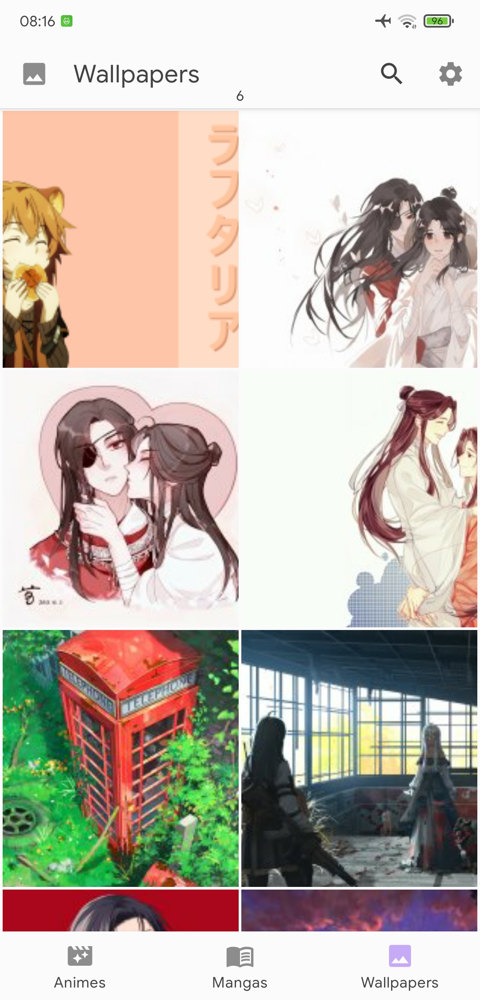
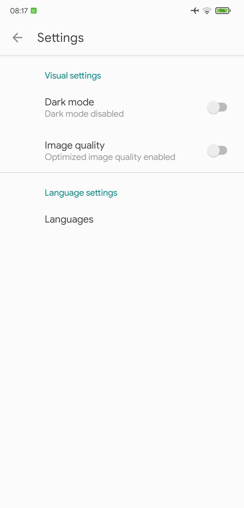
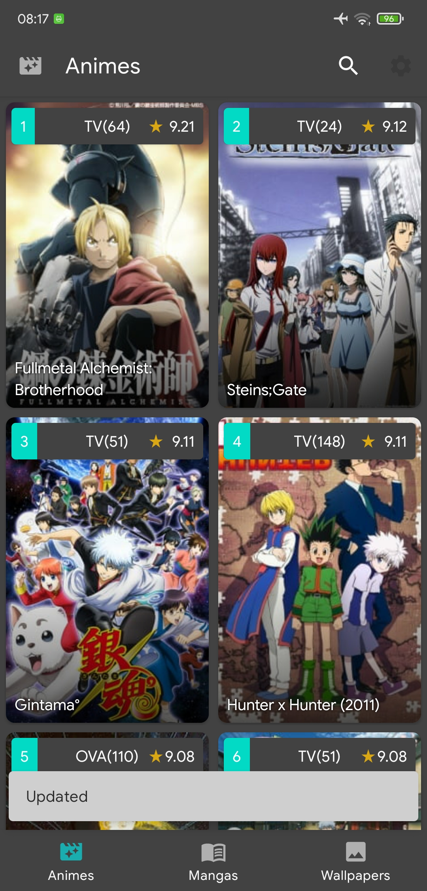
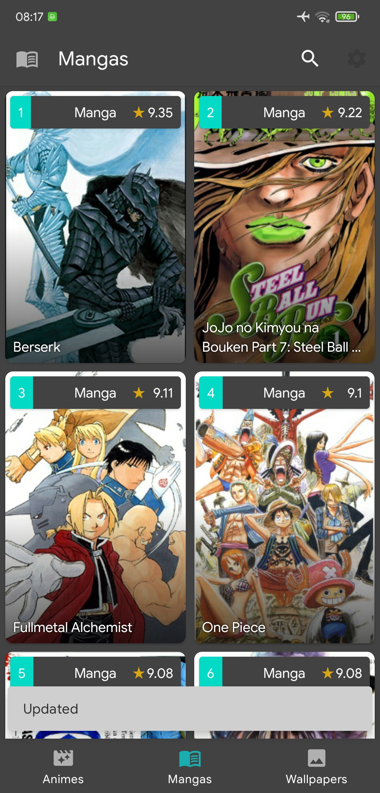
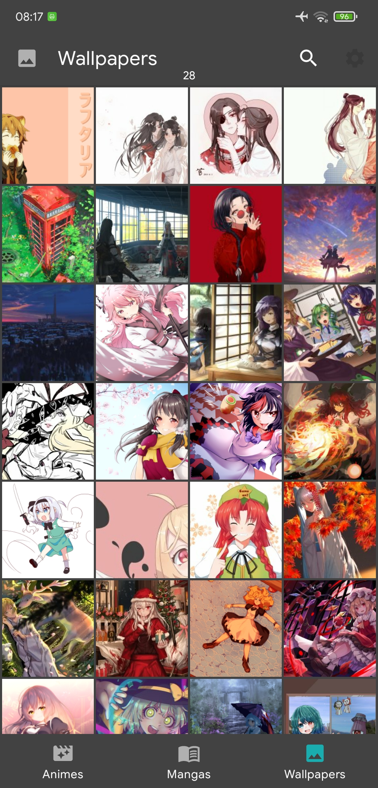

# INDEX 📋

* **Punpun**  
  + [**About project**](#about-project) ⭐
  + [**Preview**](#preview) 🔍
  + [**Screenshots**](#screenshots) 📷
  + [**Technologies**](#technologies) 💻
  + [**Setup**](#setup) 🔧
  + [**Usage**](#usage) 📋
  + [**Status**](#status) ⚪
  + [**Contact**](#contact) 📞

# About project⭐

**Date**: November, 2020.   
**Duration**: 2 weeks.

This project was developed in order to learn **Android** and develop my first native app; 

I use **2** API for this project.
[**Wallpaper Abyss:**](https://wall.alphacoders.com/api.php)  For display images from WallpaperActivity. You will need a key for use this api.

[**Jikan API:**](https://jikan.docs.apiary.io/)  For display data from animes/manga from myanimelist. This api doesnt need no key because its not official.

# Preview🔍

[💠You can try it!💠](https://github.com/Hukex/Punpun/blob/master/app/release/punpun.apk?raw=true)

Dark Mode


Normal Mode


# Screenshots📷

> 
> 
> 
> 
> 
> 
> 
>  
> 

# Technologies💻

* **JAVA**
* **Android Studio**

# Setup🔧

If you want to try the app just go to preview and click on "You can try it!" download the .apk file and you can install without problems in your device (Android5.0+)

In case you want to edit it, well I use Android Studio 4.1.1 so install it and you will be able to open it without any problem (Need a key on string.xml of first api to work). Remember to clone the project to avoid issues with the project.

``` bash
git clone https://github.com/Hukex/Punpun.git
```

# Usage📋

# Status⚪

**Pending.**

It was for practice but I will add new things and fix some bugs.

# Contact📞

My name is [Fernando](https://www.linkedin.com/in/fevm/), you can contact me if you desire!

## 😃 Thanks for reading. 👋
